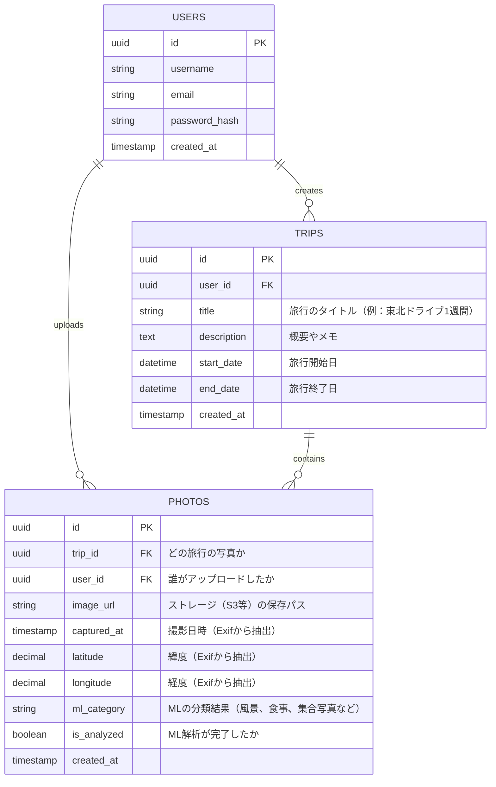

# データベース設計（初期案）

この旅行軌跡＆写真自動分類アプリ（Travel Log App）では、主に「ユーザー」「旅行イベント」「写真（位置情報と画像分類）」の3つの軸でデータを管理します。
バックエンド開発に移行しやすいよう、拡張性も考慮したPostgreSQL用の初期テーブル設計案です。

## テーブル構成とER図

## 各テーブルの役割とアピールポイント

### 1. `users` (ユーザー)
* ログイン機能やアクセス制御を担う基本的なテーブル。

### 2. `trips` (旅行・イベント)
* 今回のアプリにおける「アルバム」や「イベント」にあたる単位です。
* このテーブルがあることで、「2026年の東北旅行」と「年末の北海道旅行」を分けて管理し、写真やルートを独立して表示させることができます。

### 3. `photos` (写真と位置情報メタデータ) **【最重要】**
* このアプリの「コア」となるデータです。
* 画像自体はS3やAWSのようなクラウドストレージ（開発時はローカルフォルダ）に保存し、ここでは**URL（パス）とExif情報（撮影日時、位置情報）**を保持します。
* **位置情報の工夫**: `latitude` と `longitude` を持たせます。フロントエンドで軌跡（ポリライン）を描く際、「対象 `trip_id` の写真を `captured_at`（撮影日時）の昇順」で取得すれば、撮影順にピンを繋ぐことができます。
* **機械学習の連携**: `ml_category`（カテゴリ）と `is_analyzed`（解析済みフラグ）を持たせています。アップロード直後は未分類とし、バックエンドの非同期処理（後からゆっくり実行される処理）でMLモデルが解析を終えたらこのカラムを「風景」などで更新する（これをDB設計の工夫として語れます）。

---

## 追加の検討事項（オプション）

現状は「写真が持つ位置情報」を繋ぎ合わせてルートを描く想定になっていますが、もし**「写真がない移動中の区間も、車のGPSみたいに細かくルートを引きたい」**という場合は、もう一つ `trajectory_points`（軌跡ポイント）というテーブルを作る必要があります。

まずはシンプルに「写真のポイントを線で繋ぐ」形でよろしいでしょうか？それとも、独立した軌跡テーブルも作っておきたいですか？
